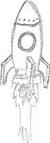
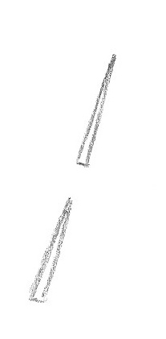
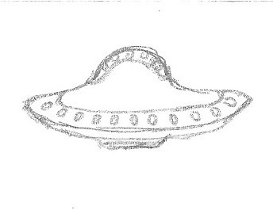
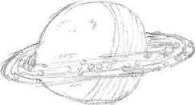
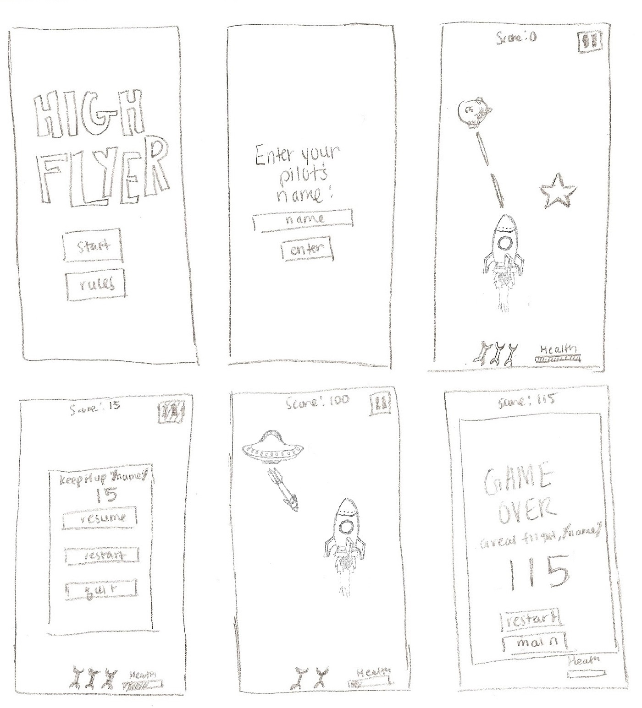

# Game Overview
The National Aeronautic Space Corporation has just received unprecedented funding for its newest space flight project to travel the universe and see the sights. (Oh and collect data on stars too, I guess). The rocket, named High Flyer, has been built and is ready to launch. Don't let all of NASC's hard work go to waste. Help the High Flyer travel to the furthest limits of the galaxy... and beyond!

----

## Gameplay

### Objects
| Object        | Role          | In gameplay          | Preliminary Appearance |
|:-------------:|---------------|----------------------|----------------------|
| Rocket Ship   | Player        | The user controls the rocketship with the keyboard arrows in order to safely guide it through space       |  |
| Laser Beam   | Weapon        | Damages enemies. Activated by left-clicking the mouse. The laser shoots (travels) quickly in the direction of the mouse, originating from the rocketship.|  |
| Meteor        | Enemy         | Appear randomly on the left of the screen and move in a straight line until going off-screen. They can move directly left to right, or may move to the right of the screen on a diagonal path. If they hit the rocket, the rocket suffers some damage |  |
| Alien ship    | Enemy         | Alien ships appear randomly from any direction off screen, and move randomy on-screen. They drop off missiles in their paths. If the alien ship collides with the rocket, the rocket suffers some damage. Alien ships can be attacked with the laser. |  |
| Missile        | Enemy        | Missiles explode after a certain period of time or if they collide with any other object. They travel in a path that follows the rocket hip. If the radius of their explosions hits the rocket, the rocket suffers damage. If the missile collides with the rocket, the rocket loses a life. If the missile collides with any other object, it is destroyed. If shot by the laser, the missile explodes.|  |
| Planet       | Barrier       | Rocket must avoid planets or else they lose a life. Planets are stationary, as in they only move with the background and not independently. |  |
| Star        | Collectable   | The rocket ship collects stars for points. Stars are collected when the rocketship collides with them. Stars are stationary in that they only move with the background and not independently. |  |

### Controls

The user will control the rocketship with the up, down, left, and right arrow keys. The laser beam will be activated when the user left-clicks the mouse on screen. The user right-clicks anywhere on screen to pause the game. On the pause screen, the user can left-click 'continue' to resume the game, 'restart' to restart, and 'quit' to exit.

### Lives
The player starts with four lives, three of which are indicated on screen by small icons. The rocketship has a health bar that depletes when hit by commets or alien bombs. When the health bar is depleted, a life is lost. A life is immediately lost when the rocket collides with a planet. When a life is lost, a life icon on screen disappears and the health bar replenishes to indicate that the player has moved on to his or her next life.
When all three lives are lost, the game ends.

###  Scoring
The aim of the game is to survive as long as possible. Scoring will correspond to the number of seconds the player has been alive. Stars collected will also factor into the score. Each star will add an equivalent of 5 seconds to the score. Scores can only increase, never decrease.
### Layout
The game will be a vertical scroller. The rocket ship will be free to move around the entirety of the screen. The background will appear to scroll down as if the rocketship is moving up in space. A pause button will be in the top right corner. Score will be displayed in the center top of the screen. Number of lives will be displayed in the center bottom of the screen.

#### Preliminary layout

