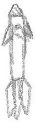

# Game Overview
The National Aeronautic Space Corporation has just received unprecedented funding for its newest space flight project to travel the universe and see the sights. (Oh and collect data on stars too, I guess). The rocket, named High Flyer, has been built and is ready to launch. Don't let all of NASC's hard work go to waste. Help High Flyer travel to the furthest limits of the galaxy... and beyond!

Pilot High Flyer through outer space as long as possible, collecting stars and avoiding obstacles. Use the arrow keys to move High Flyer and the mouse to shoot lasers at enemies.

----

## Gameplay

### Objective
Survive as long as possible. Avoid comets, alien ships, missiles, and planets. Collect stars for extra points.

### Objects
| Object        | Role          | In gameplay          | Preliminary Appearance |
|:-------------:|---------------|----------------------|----------------------|
| Rocket Ship   | Player        | The user controls the rocketship with the keyboard arrows in order to safely guide it through space       |  |
| Laser Beam   | Weapon        | Damages enemies. Activated by left-clicking the mouse. The laser shoots (moves) quickly in the direction of the mouse, originating from the rocketship. Only shoots above the rocketship, not below|  |
| Meteor        | Enemy         | Appear randomly on the left of the screen and move in a straight line until going off-screen on the right side. If they hit the rocket, the rocket suffers damage. Meteors can be destroyed by the laser. |  |
| Alien ship    | Enemy         | Alien ships appear randomly from off screen, and move randomy on-screen. They drop off missiles in their paths. If the alien ship collides with the rocket, the rocket suffers damage. Alien ships can be attacked with the laser. |  |
| Missile        | Enemy        | Missiles originate from the location of an Alien ship and travel in a path that follows the rocket. If the missile collides with the rocket, the rocket loses a life. |  |
| Planet       | Barrier       | Rocket must avoid colliding with planets or else they lose a life. Planets only move with the background (so only move vertically down). |  |
| Star        | Collectable   | The rocket ship collects stars for points. Stars are collected when the rocketship collides with them. Stars move vertically downward with the background, in a twitchy pattern as if they were blinking. |  |

### Controls

##### In-game
  * Up, down, left, right arrow keys: controls the rocketship's movement
  * Left click: Shoots a laser from the rocket to the location of the mouse. If left-clicking the pause button, pauses the game
  
##### Menus
  * Left click: selects an option, whether to Start, Pause, Continue, Restart, or Quit.
  * Keyboard: Allows the user to type in his/her name when the name field is on screen

###  Scoring
Scoring corresponds to how long the player has been playing. The score increases by 1 point every 20 times the times outs. Collecting a star adds 10 points to the score. Scores can only increase, never decrease.

### Lives
The player starts with four lives, three of which are indicated on screen. The rocketship has health points that deplete when hit by meteors, aliens, or missiles. When the health is depleted, a life is lost. A life is immediately lost when the rocket collides with a planet. When a life is lost, the life counter decreases and the health points replenishe to indicate that the player has moved on to his or her next life.
When all four lives are lost, the game ends.

## Layout
The game will be a vertical scroller. The rocket ship will be free to move around the entirety of the screen. The background will appear to scroll down as if the rocketship is moving up in space. The rest of the layout will consist of the following:
  - A pause button in the top corner. 
  - Score, displayed in the right bottom of the screen. 
  - Number of lives and health bar, displayed in the center bottom of the screen.

In the pause menu, there will be buttons to continue, restart, or quit the game.

### Preliminary layout
|               |               |                      |
|:-------------:|---------------|----------------------|
|
|
|
|

